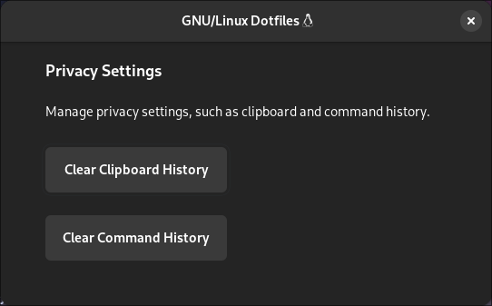

# hyprsettings

An GTK4 application for managing privacy settings through a graphical user interface. It provides button to clear clipboard history and command history with simple button clicks.



## Why?

Lazy, and i want try GTK4 :D

## Features

- **Clear Clipboard History:** Clears the clipboard history securely (cliphist wipe).
- **Clear Command History:** Clears the command history (history -cw).

## Usage

```bash
python gtk4.py
```
## License

[MIT License](./LICENSE)
